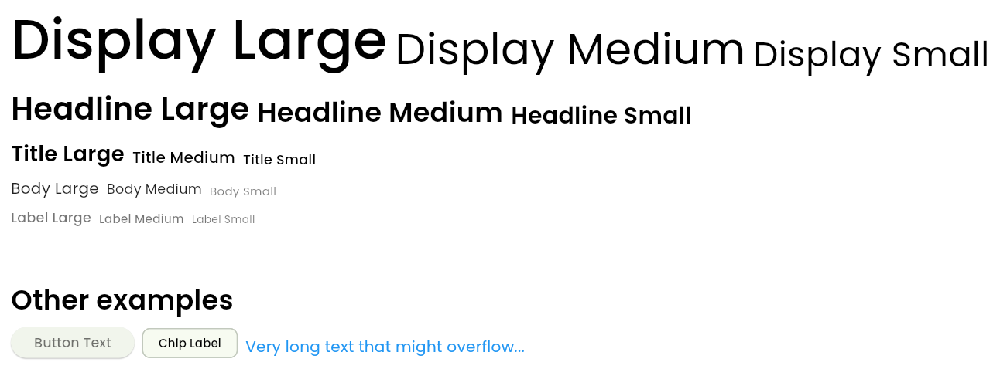

# FlutterX Starter Kit


[](https://pub.dev/packages/flutterx_starter_kit) [](https://pub.dev/packages/flutterx_starter_kit/score) [](https://pub.dev/packages/flutterx_starter_kit/score)

A comprehensive starter kit that accelerates Flutter app development with ready-to-use components and best practices, especially for GetX state management.

## Features

### ✅ Currently Available

- **CLI Helpers** - Generate your project fast code fast deploy
- **ApiClient** - Powerful HTTP client with complete features
- **UI Components** - Widget library (TextKit)

### Coming Soon

- **Responsive Utils** - Helper for responsive design
- **Logger** - Advanced logging system

## Platform Support

| Android | iOS | MacOS | Web |
|---------|-----|-------|-----|
| ✅      | ✅  | ✅    | ✅  |

## Requirements

- Flutter: `>=1.17.0`
- Dart: `>=3.9.0`

## Installation

Add this package to your `pubspec.yaml`:

```yaml
dependencies:
  flutterx_starter_kit: 0.0.5
```

Or install via command line:

```bash
flutter pub add flutterx_starter_kit
```

## Getting Started

### Setup

Add dependencies `flutter_dotenv`

```bash
flutter pub add flutter_dotenv
```

Create `.env` in root folder

```env
API_BASE_URL = www.example-api.com
```

Add `.env` to `assets`

```yml
flutter:
  assets:
    - .env
```

Don't forget add `async` in your `main()`

```dart
void main() async {
```

### Initialize ApiClient with CLI

```bash
flutter pub global activate flutterx_starter_kit
```

Or

```bash
dart pub global activate flutterx_starter_kit
```

Add flutterx ApiClient:

```bash
flutterx init
```

Add flutterx font:

```dart
// default
flutterx font

// long syntax
flutterx font --name montserrat

// short syntax
flutterx font -name nunito
```

### ApiClient Usage

API Reference

### Instance Methods

- GET request - `get(String endpoint, {Map<String, dynamic>? query, ApiRequestOptions opts})`
- POST request - `post(String endpoint, dynamic body, {Map<String, dynamic>? query, ApiRequestOptions opts})`
- PUT request - `put(String endpoint, dynamic body, {Map<String, dynamic>? query, ApiRequestOptions opts})`
- PATCH request - `patch(String endpoint, dynamic body, {Map<String, dynamic>? query, ApiRequestOptions opts})`
- DELETE request - `delete(String endpoint, {Map<String, dynamic>? query, ApiRequestOptions opts, dynamic body})`

### `ApiConfig`

Configuration for ApiClient.

**Properties:**

- `baseUrl` (String) - API base URL without trailing slash
- `timeout` (Duration) - Request timeout, default 20 seconds
- `tokenProvider` (TokenProvider?) - Function to get access token
- `refreshToken` (RefreshToken?) - Function to refresh token on 401
- `defaultHeaders` (DefaultHeadersBuilder?) - Function for global headers
- `onUnauthorized` (OnUnauthorized?) - Callback when unauthorized
- `httpClient` (http.Client?) - Custom HTTP client

### `ApiRequestOptions`

Per-request options to override global configuration.

**Properties:**

- `baseUrl` (String?) - Override base URL for this request
- `headers` (Map<String, String>?) - Additional/override headers
- `skipAuth` (bool) - Skip Authorization header, default false
- `query` (Map<String, dynamic>?) - Query parameters

### `ApiResponse<T>`

Response wrapper from HTTP request.

**Properties:**

- `statusCode` (int) - HTTP status code
- `data` (T?) - Parsed response body (JSON → Map/List)
- `headers` (Map<String, String>) - Response headers

### Exceptions

#### `ApiException`

Exception for HTTP errors (4xx, 5xx).

**Properties:**

- `statusCode` (int?) - HTTP status code
- `message` (String) - Error message
- `data` (dynamic) - Response body

```dart
import 'package:flutterx_starter_kit/flutterx_starter_kit.dart';

// GET request
final response = await ApiClient.instance.get('/users');
print(response.data); // parsed JSON response

// POST request
final newUser = await ApiClient.instance.post('/users', {
  'name': 'John Doe',
  'email': 'john@example.com',
});

// PUT request
final updated = await ApiClient.instance.put('/users/1', {
  'name': 'Jane Doe',
});

// DELETE request
await ApiClient.instance.delete('/users/1');
```

Others Example

```dart
//example 1
import 'package:flutter/material.dart';
import 'package:flutterx_starter_kit/flutterx_starter_kit.dart';

String? accessToken = 'xxx123xxx123';

void main() {
  ApiClient.init(ApiConfig(
    baseUrl: 'https://jsonplaceholder.typicode.com',
    tokenProvider: () async => accessToken, // Set global Authorization
  ));
  runApp(MyApp());
}

//example 2
final public = await ApiClient.instance.get('/v1/info',
  opts: const ApiRequestOptions(skipAuth: true), // Skip headers
);

//example 3
await ApiClient.instance.get(
  '/v1/public-info',
  opts: const ApiRequestOptions(
    skipAuth: true,
    headers: {'X-Trace': 'abc123'}, // Need others headers
  ),
);

//example 4
ApiClient.init(ApiConfig(baseUrl: 'https://api.example.com'));
// Not set global, need authorization
final res1 = await ApiClient.instance.get(
  '/v1/secure-data',
  opts: const ApiRequestOptions(
    headers: {'Authorization': 'Bearer xxx123xxx123'}, // If not set global, add 'Bearer'
  ),
);
// Not set global, no needed authorization
final res2 = await ApiClient.instance.get('/v1/public-info');
```

### TextKit Usage



Currently Supported Fonts

| Font Name | Command | Font Name | Command |
|-----------|---------|-------|----------|
| **Poppins** | `--font poppins` | **Inter** | `--font inter` |
| **Fredoka** | `--font fredoka` | **Raleway** | `--font raleway` |
| **Roboto** | `--font roboto` | **Nunito** | `--font nunito` |
| **Montserrat** | `--font montserrat` | **Lato** | `--font lato` |
| **Open Sans** | `--font opensans` | (upcoming) | (upcoming) |

Quick Reference

| Method         | Size | Method   | Size                   |
|----------------|:----:|----------|------------------------|
| `displayLarge` |  57  | `labelLarge`    | 14              |
| `displayMedium`|  45  | `labelMedium`   | 12              |
| `displaySmall` |  36  | `labelSmall`    | 11              |
| `headLineLarge`|  32  | `bodyLarge`     | 16              |
| `headLineMedium`| 28  | `bodyMedium`    | 14              |
| `headLineSmall`|  24  | `bodySmall`     | 12              |
| `titleLarge`   |  22  |                 |                 |
| `titleMedium`  |  16  |                 |                 |
| `titleSmall`   |  14  |                 |                 |

example

```dart
import 'package:flutter/material.dart';
import 'package:flutterx_starter_kit/flutterx_starter_kit.dart';

class Fontkit extends StatelessWidget {
  const Fontkit({super.key});

  @override
  Widget build(BuildContext context) {
    return Scaffold(
      body: SingleChildScrollView(
        child: Padding(
          padding: const EdgeInsets.all(16.0),
          child: SizedBox(
            width: double.infinity,
            child: Column(
              spacing: 8,
              crossAxisAlignment: CrossAxisAlignment.start,
              children: [
                Row(
                  spacing: 8,
                  crossAxisAlignment: CrossAxisAlignment.end,
                  children: [
                    TextKit.displayLarge('Display Large'),
                    TextKit.displayMedium('Display Medium'),
                    TextKit.displaySmall('Display Small'),
                  ],
                ),
                Row(
                  spacing: 8,
                  crossAxisAlignment: CrossAxisAlignment.end,
                  children: [
                    TextKit.headlineLarge('Headline Large'),
                    TextKit.headlineMedium('Headline Medium'),
                    TextKit.headlineSmall('Headline Small'),
                  ],
                ),
                Row(
                  spacing: 8,
                  crossAxisAlignment: CrossAxisAlignment.end,
                  children: [
                    TextKit.titleLarge('Title Large'),
                    TextKit.titleMedium('Title Medium'),
                    TextKit.titleSmall('Title Small'),
                  ],
                ),
                Row(
                  spacing: 8,
                  crossAxisAlignment: CrossAxisAlignment.end,
                  children: [
                    TextKit.bodyLarge('Body Large'),
                    TextKit.bodyMedium('Body Medium'),
                    TextKit.bodySmall('Body Small'),
                  ],
                ),
                Row(
                  spacing: 8,
                  crossAxisAlignment: CrossAxisAlignment.end,
                  children: [
                    TextKit.labelLarge('Label Large'),
                    TextKit.labelMedium('Label Medium'),
                    TextKit.labelSmall('Label Small'),
                  ],
                ),
                SizedBox(height: 40),
                TextKit.headlineMedium('Other examples'),
                Row(
                  spacing: 8,
                  crossAxisAlignment: CrossAxisAlignment.end,
                  children: [
                    ElevatedButton(
                      onPressed: () {},
                      child: TextKit.labelLarge('Button Text'),
                    ),
                    Chip(
                      label: TextKit.labelMedium(
                        'Chip Label',
                        color: Colors.black,
                      ),
                    ),
                    TextKit.bodyLarge(
                      'Very long text that might overflow...',
                      maxLines: 2,
                      overflow: TextOverflow.ellipsis,
                      color: Colors.blue,
                    ),
                  ],
                ),
              ],
            ),
          ),
        ),
      ),
    );
  }
}
```

### ButtonKit Usage


example

```dart
import 'package:flutterx_starter_kit/flutterx_starter_kit.dart';

class Fontkit extends StatelessWidget {
  const Fontkit({super.key});
  @override
  Widget build(BuildContext context) {
    return Scaffold(
      body: SingleChildScrollView(
        child: Padding(
          padding: const EdgeInsets.all(16.0),
          child: SizedBox(
            width: double.infinity,
            child: Column(
              spacing: 8,
              crossAxisAlignment: CrossAxisAlignment.start,
              children: [
                ButtonKit(
                  text: "Sign In",
                  textColor: Colors.white,
                  bgColor: Colors.blue,
                  press: () {},
                  width: 200,
                  height: 50,
                ),
                ButtonKitGradient(
                  text: "This is Gradient",
                  textColor: Colors.white,
                  bgColor1: Colors.cyan,
                  bgColor2: Colors.purpleAccent,
                  press: () {},
                  width: 200,
                ),
              ],
            ),
          ),
        ),
      ),
    );
  }
}
```

## Additional Information

### Issues and Feedback

If you find a bug or have a feature suggestion:

- 🐛 [Report bugs](https://github.com/ramadhanhadiatmaa/flutterx_starter_kit/issues)
- 💡 [Request features](https://github.com/ramadhanhadiatmaa/flutterx_starter_kit/issues)
- 💬 [Ask questions](https://github.com/ramadhanhadiatmaa/flutterx_starter_kit/discussions)

### Roadmap

- [ ] UI Components (Button, Card, TextField, etc.)
- [ ] Responsive utilities
- [ ] Theme management
- [ ] Navigation utilities
- [ ] Advanced logging system
- [ ] Performance monitoring

### License

This package is licensed under the [MIT License](https://github.com/ramadhanhadiatmaa/flutterx_starter_kit/blob/main/LICENSE).

### Author

#### Ramadhan Hadiatma

- GitHub: [@ramadhanhadiatmaa](https://github.com/ramadhanhadiatmaa)
- Repository: [flutterx_starter_kit](https://github.com/ramadhanhadiatmaa/flutterx_starter_kit)

### Support

If this package helps you, consider:

- ⭐ Star the repository on [GitHub](https://github.com/ramadhanhadiatmaa/flutterx_starter_kit)
- 👍 Like the package on [pub.dev](https://pub.dev/packages/flutterx_starter_kit)
- 📢 Share with other Flutter developers

---

Made with ❤️ by [Ramadhan Hadiatma](https://github.com/ramadhanhadiatmaa)
